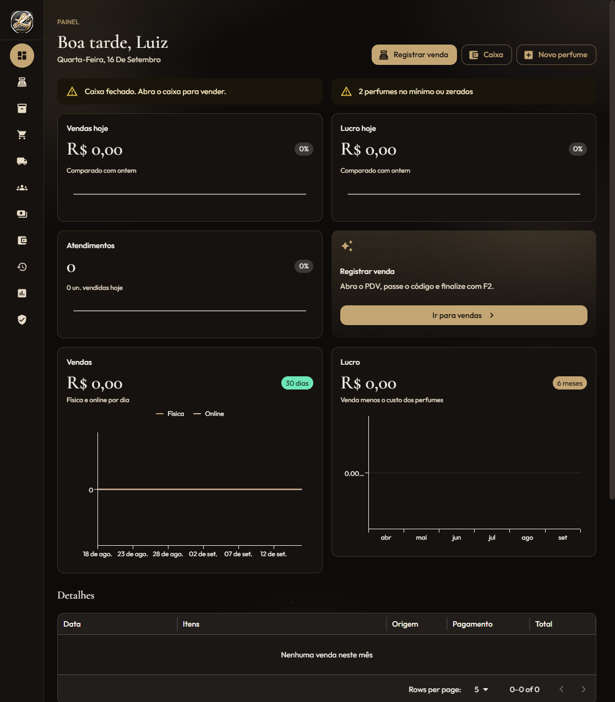
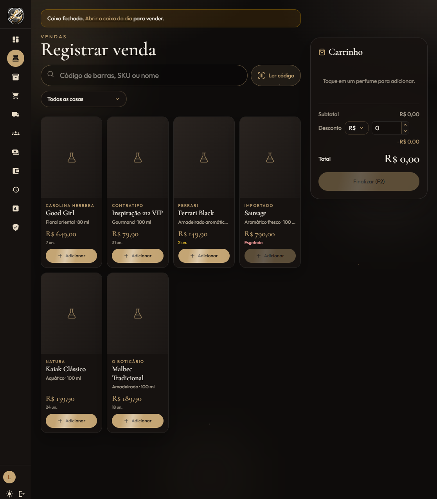
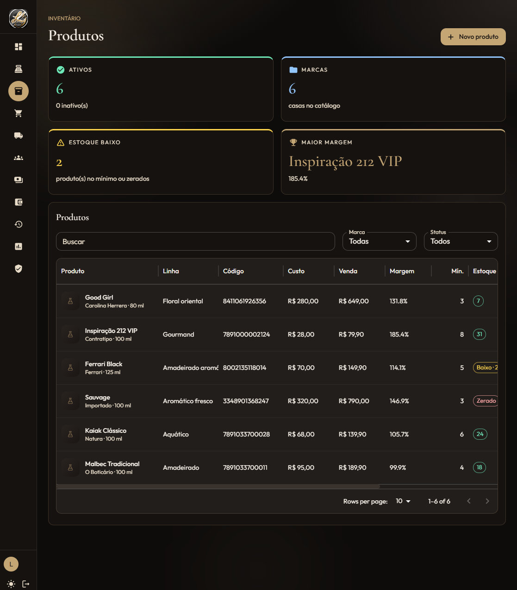

# Essential System

PDV completo para loja de perfumes: vendas (física/online), estoque, caixa, compras, clientes, contas a receber e relatórios.



## Stack

- **Frontend:** React + Vite + TypeScript + Tailwind / MUI
- **Backend:** Node.js + Express
- **ORM:** Prisma (SQLite no desenvolvimento; PostgreSQL do Supabase em produção)
- **Storage:** Supabase Storage (bucket `produtos-fotos`) — opcional; sem ele as fotos vão para `backend/uploads`

## Telas

| Módulo | O que faz |
|--------|-----------|
| Painel | KPIs do dia, gráficos e alertas de estoque/caixa |
| Vendas (PDV) | Busca por SKU/código, carrinho, desconto, atalho F2 |
| Produtos / Estoque | Cadastro com foto, margem, estoque mínimo |
| Caixa | Abertura, sangria, suprimento e fechamento |
| Compras / Fornecedores | Entrada de mercadoria |
| Clientes / A receber | Cadastro e fiado |
| Histórico / Relatórios | Reimpressão, cancelamento e mais vendidos |
| Mensalidade | Licença com PIX e renovação |





## Como rodar (local)

### 1. Variáveis de ambiente

Na raiz, copie `.env.example` para `.env`. Para desenvolvimento **sem Supabase**, deixe as chaves vazias:

```env
DATABASE_URL="file:./dev.db"
SUPABASE_URL=
SUPABASE_SERVICE_ROLE_KEY=
PORT=3001
PUBLIC_API_URL="http://localhost:3001"
CLIENT_ORIGIN="http://localhost:5173"
```

No frontend, `frontend/.env`:

```env
VITE_API_URL=http://localhost:3001
```

Use a **service_role** só no backend. Nunca no React.

### 2. Instalar, migrar e seed

```bash
npm install
npx prisma migrate deploy
npx prisma generate
npm run db:seed
```

### 3. Subir

```bash
npm run dev
```

- Interface: http://localhost:5173  
- API: http://localhost:3001  

**Login demo (seed):** usuário `luiz` · senha `1234`  
Troque essa senha em qualquer ambiente real.

## Supabase Storage (opcional)

1. Crie o bucket público `produtos-fotos`
2. Preencha `SUPABASE_URL` e `SUPABASE_SERVICE_ROLE_KEY` no `.env`
3. Políticas de exemplo no `.env.example` / histórico do README anterior

Sem Storage, o upload local em `/uploads` continua funcionando.

## Segurança

- `.env` não é versionado (só `.env.example`)
- Não commite `service_role`, PIX real ou `LICENCA_MASTER_KEY`
- O admin seed (`luiz` / `1234`) é só para desenvolvimento

## Autor

**Luiz Gustavo Marques** — [GitHub](https://github.com/luiz775) · [LinkedIn](https://www.linkedin.com/in/luiz-gustavo140694/)
